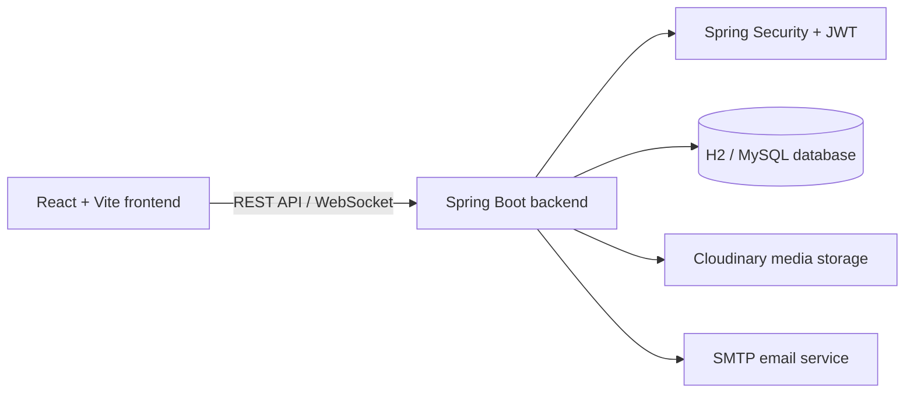

<div align="center">

# 🎓 SyncroLearn

### Learn together. Teach what you know. Grow further.

<p>
  <strong>A full-stack peer-to-peer learning platform for students, tutors, and administrators.</strong>
</p>

<p>
  <a href="https://github.com/chandrika131105/Syncro_Learn">
    
  </a>
  <a href="https://github.com/chandrika131105/Syncro_Learn">
    
  </a>
  
  
  
</p>

<p>
  <a href="#-features">Features</a> •
  <a href="#-quick-start">Quick start</a> •
  <a href="#-architecture">Architecture</a> •
  <a href="#-project-structure">Project structure</a>
</p>

</div>

---

## ✨ What is SyncroLearn?

SyncroLearn turns online learning into a connected community. Students can discover courses, learn from experienced tutors, complete quizzes, earn certificates, and track their progress. Tutors can share their expertise by creating and managing courses, while administrators keep the platform healthy and engaging.

<table>
<tr>
<td width="33%" align="center">
<h3>📚 Learn</h3>
Discover courses, follow structured modules, watch lessons, complete quizzes, and build real skills.
</td>
<td width="33%" align="center">
<h3>🧑‍🏫 Teach</h3>
Create courses, publish learning content, manage modules, and help other learners succeed.
</td>
<td width="33%" align="center">
<h3>🏆 Grow</h3>
Earn certificates, collect badges, climb leaderboards, and measure your learning progress.
</td>
</tr>
</table>

## 🚀 Features

<table>
<tr>
<td width="50%">

### 🎯 Student experience

- Course browsing and detailed course pages
- Secure signup, login, and protected routes
- Enrollment and learning progress tracking
- Video and PDF learning resources
- Quizzes and instant results
- Wishlist and course comparison
- Certificates and public verification

</td>
<td width="50%">

### 🛠️ Platform experience

- Tutor studio for course creation and editing
- Student and tutor leaderboards
- Gamification, badges, and activity tracking
- Discussions and real-time chat support
- Admin dashboard and system settings
- Global announcements and maintenance mode
- Cloudinary media upload integration

</td>
</tr>
</table>

## 🧩 Architecture



## 🧰 Tech stack

| Layer | Technologies |
| --- | --- |
| Frontend | React 19, Vite, React Router, Tailwind CSS, Framer Motion, Recharts |
| Backend | Java 21, Spring Boot 3.5, Spring Web, Spring Security, Spring Data JPA |
| Data | H2 for local development, MySQL-ready configuration |
| Authentication | JWT access tokens, role-based authorization |
| Integrations | Cloudinary, SMTP mail, WebSocket/STOMP |
| Quality | Maven tests, JUnit, Spring Security Test, Testcontainers |

## ⚡ Quick start

### Prerequisites

- [Node.js](https://nodejs.org/) 18 or newer
- npm
- [Java](https://adoptium.net/) 21 or newer
- Maven, or the Maven wrapper included in the backend

### 1. Start the backend

```powershell
cd studysync-backend
.\mvnw.cmd spring-boot:run
```

The backend uses an H2 in-memory database by default and starts on the Spring Boot default port.

### 2. Start the frontend

Open a second terminal:

```powershell
cd studysync-frontend
npm install
npm run dev
```

Then open the Vite URL shown in the terminal, usually `http://localhost:5173`.

### Production frontend build

```powershell
cd studysync-frontend
npm run build
```

## 🗂️ Project structure

```text
Syncro_Learn/
├── README.md
├── studysync-frontend/
│   ├── src/pages/          # Landing, dashboard, course, quiz, admin views
│   ├── src/components/     # Reusable UI and learning components
│   ├── src/services/       # Frontend API integration
│   └── package.json
└── studysync-backend/
    ├── src/main/java/
    │   ├── controller/     # REST and WebSocket endpoints
    │   ├── service/        # Business logic
    │   ├── model/          # JPA entities
    │   ├── repository/     # Persistence access
    │   └── config/         # Security and application configuration
    ├── src/test/            # Unit and integration tests
    └── pom.xml
```

## 🔐 Configuration

For production deployments, provide secrets through environment variables instead of committing credentials:

| Variable | Purpose |
| --- | --- |
| `JWT_SECRET` | Signs and validates authentication tokens |
| `CLOUDINARY_CLOUD_NAME` | Cloudinary account name |
| `CLOUDINARY_API_KEY` | Cloudinary API key |
| `CLOUDINARY_API_SECRET` | Cloudinary API secret |
| Mail settings | SMTP credentials for email notifications |

The local H2 configuration is intended for development only. Use a managed SQL database and strong secrets in production.

## 📖 More documentation

| Area | Guide |
| --- | --- |
| Frontend | [`studysync-frontend/README.md`](studysync-frontend/README.md) |
| Backend | [`studysync-backend/HELP.md`](studysync-backend/HELP.md) |
| Engineering rules | [`studysync-backend/PROJECT_CONSTRAINTS.md`](studysync-backend/PROJECT_CONSTRAINTS.md) |

## 🌱 Contributing

1. Create a feature branch from `main`.
2. Keep frontend and backend changes focused.
3. Run the relevant frontend build or backend tests.
4. Open a pull request with a clear description and screenshots for UI changes.

## 📄 License

This project is intended for educational and portfolio use unless otherwise specified by the repository owner.

<div align="center">

### Made for curious learners and generous teachers 💙

</div>
