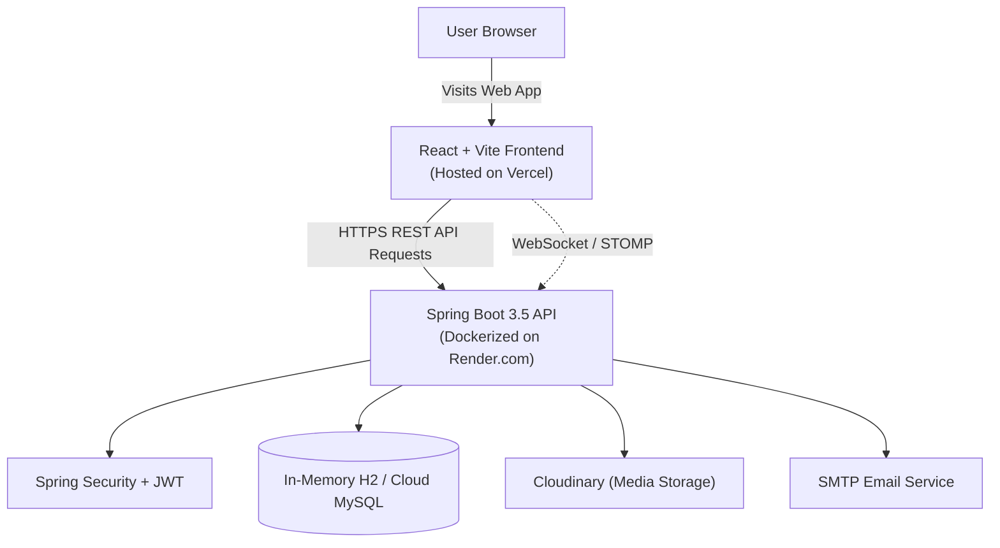

<div align="center">

# 🎓 SyncroLearn

### Your university community can learn, teach, and grow together.

<p>
  <strong>A peer-learning platform where students share knowledge, tutors build courses, faculty support learning, and every completed course can become a verified achievement.</strong>
</p>

<p>
  <a href="https://github.com/chandrika131105/Syncro_Learn">
    
  </a>
  <a href="https://github.com/chandrika131105/Syncro_Learn">
    
  </a>
  
  
  
</p>

<p>
  <a href="#-the-vision">Vision</a> •
  <a href="#-who-is-it-for">Who is it for?</a> •
  <a href="#-features">Features</a> •
  <a href="#-live-demo--demo-credentials">Live Demo</a> •
  <a href="#-quick-start">Quick start</a> •
  <a href="#-architecture">Architecture</a>
</p>

</div>

---

## 🌐 Live Demo & Demo Credentials

> 🚀 **Explore the live deployed application:**
> - **Live Web App**: [https://syncro-learn.vercel.app](https://syncro-learn.vercel.app)
> - **Backend REST API**: [https://syncro-learn.onrender.com](https://syncro-learn.onrender.com)
> 
> ⏱️ *Note: The backend is hosted on a free cloud instance (Render). Please allow ~30 seconds for the initial wake-up if the service was idle.*

### 🔑 Instant Demo Accounts for Testing

| Role | Demo Email | Password | What to Explore |
| :--- | :--- | :--- | :--- |
| **🛡️ Admin** | `admin@studysync.com` | `password` | Course approval queue, user role management, system-wide moderation |
| **🧑‍🏫 Tutor** | `tutor@studysync.com` | `password` | Tutor Studio, module authoring, video/PDF upload, quiz builder |
| **🎒 Student** | `user1@studysync.com` | `password` | Browse & enroll in courses, video lesson player, quizzes, verifiable certificate download |

---

## 🌟 The vision

SyncroLearn is designed for a university learning community where knowledge does not flow in only one direction.

A student who is excellent at a subject, tool, or practical topic can become a tutor, record a course, share it with fellow students, and earn part-time income from the value they create. Faculty members and experienced educators can also publish structured courses, add assessments, and guide learners through a complete learning journey.

Students get one place to:

- Learn from peers, tutors, and faculty
- Find focused courses beyond the traditional classroom
- Learn through video, documents, discussions, and quizzes
- Track progress and build a record of completed learning
- Earn certificates that can be verified after course completion

SyncroLearn combines a university learning community with the flexibility of a creator-led learning marketplace.

## 👥 Who is it for?

<table>
<tr>
<td width="33%" align="center">
<h3>🎒 Students</h3>
Learn from classmates and educators, complete courses, take quizzes, earn certificates, and build a stronger academic and practical profile.
</td>
<td width="33%" align="center">
<h3>🧑‍🏫 Student tutors</h3>
Turn strong subject knowledge into structured video courses, help peers learn, grow an instructor reputation, and earn part-time income.
</td>
<td width="33%" align="center">
<h3>🏫 Faculty & admins</h3>
Publish high-quality learning content, review courses, support the community, moderate discussions, and manage the platform.
</td>
</tr>
</table>

> **Current role model:** the application currently uses `STUDENT`, `TUTOR`, and `ADMIN` roles. Faculty-style course publishing is supported through the tutor workflow, while governance and approvals are handled through admin capabilities. A separate `FACULTY` role can be added as the university deployment evolves.

## 🔁 How SyncroLearn works

<table>
<tr>
<td width="50%" valign="top">

### 🎒 For a student

| Step | Journey |
| --- | --- |
| **01** | Discover a course or topic |
| **02** | Compare courses, save a wishlist, and enroll |
| **03** | Watch videos and read PDF notes |
| **04** | Discuss lessons with peers and tutors |
| **05** | Complete module quizzes |
| **06** | Track progress, XP, badges, and analytics |
| **07** | Finish the course and receive a certificate |

</td>
<td width="50%" valign="top">

### 🧑‍🏫 For a tutor or faculty educator

| Step | Journey |
| --- | --- |
| **01** | Share expertise in a subject or practical topic |
| **02** | Create a structured course |
| **03** | Add modules, videos, PDFs, and quizzes |
| **04** | Submit the course for review and publishing |
| **05** | Teach learners through course discussions |
| **06** | Build instructor recognition and reputation |
| **07** | Create a part-time income opportunity |

</td>
</tr>
</table>

## 🚀 Features

### 📚 Learning experience

| Capability | What learners can do |
| --- | --- |
| Course discovery | Browse, search, view recommendations, and inspect course details |
| Course comparison | Compare price, rating, modules, estimated hours, and value |
| Flexible content | Learn from video lessons, PDF notes, and structured modules |
| Enrollment | Join courses and access a personal learning dashboard |
| Progress tracking | Save course progress, module completion, and video positions |
| Quizzes | Take multiple-choice module quizzes and review results |
| Discussions | Ask questions, reply to peers, upvote useful discussions, and identify tutor answers |
| Wishlist | Save interesting courses for later |
| Analytics | Review completion percentages, learning time, weekly activity, and goals |

### 🏆 Completion and recognition

- Course completion tracking at both course and module level
- Downloadable completion certificates
- Public certificate verification through `/verify` and `/verify/:code`
- Certificate records showing validity, learner, course, and issue date
- Knowledge points, levels, learning streaks, achievements, and badges
- Student **Hall of Fame** leaderboard
- Tutor **Top Instructors** leaderboard

### 🎥 Tutor and faculty-style publishing

Tutors can use the Tutor Studio to:

- Create a course with a title, description, price, and thumbnail
- Add and edit modules
- Add video resources and PDF/notes content
- Create quiz questions and multiple-choice answers
- Upload learning files
- Monitor enrollment counts and course performance
- See instructor revenue estimates and ratings
- Edit or remove published course content

This enables a student with strong knowledge in a subject or practical topic to package that knowledge into a video-based course and create a part-time income opportunity while helping classmates.

### 🛡️ Admin and university-community controls

Administrators can:

- View platform overview metrics
- Manage users and change roles
- Ban or restore accounts
- Review pending courses
- Approve, reject, or delete courses
- Moderate and hide community discussions
- View financial and platform-fee statistics
- Configure global announcements
- Enable maintenance mode while keeping admin access

## 🎓 Example journeys

### Student learning journey

1. A student signs up and explores courses.
2. They compare courses or save them to their wishlist.
3. They enroll in a course and open its modules.
4. They watch videos, read PDFs, and discuss questions.
5. They complete module quizzes and their progress is saved.
6. They finish the course and download a certificate.
7. Anyone with the certificate code can verify the achievement.

### Peer tutor journey

1. A student identifies a subject or practical skill they know well.
2. They register as a tutor and open Tutor Studio.
3. They create a course with video lessons, notes, modules, and quizzes.
4. The course can go through platform approval before publishing.
5. Other students enroll and learn from the course.
6. The tutor builds recognition through enrollments, ratings, discussions, and the instructor leaderboard.
7. Course performance and revenue estimates support a part-time teaching opportunity.

### Faculty educator journey

1. A faculty member creates a structured course using the same authoring workflow.
2. They organize content into modules and assessments.
3. Students learn asynchronously and discuss concepts inside the course.
4. Quiz outcomes and progress provide a learning signal.
5. Students who complete the course receive a verifiable certificate.

> Faculty is currently represented by the existing tutor/content-creator flow. University identity, departments, terms, credits, institutional SSO, and a dedicated faculty role are natural next steps for a university-specific deployment.

## 🧩 Architecture
 


## 🧰 Technology stack

| Layer | Technologies |
| --- | --- |
| Frontend | React 19, Vite, React Router, Tailwind CSS, Framer Motion, Recharts |
| Backend | Java 21, Spring Boot 3.5, Spring Web, Spring Security, Spring Data JPA |
| Data | H2 for local development, MySQL-ready configuration |
| Authentication | JWT access tokens and role-based authorization |
| Learning media | Video player, PDF viewer, file upload, Cloudinary integration |
| Communication | Course discussions and WebSocket/STOMP support |
| Quality | Maven tests, JUnit, Spring Security Test, Testcontainers |

## ⚡ Quick start

### Prerequisites

- [Node.js](https://nodejs.org/) 18 or newer
- npm
- [Java](https://adoptium.net/) 21 or newer
- Maven, or the Maven wrapper included in the backend

### Start the backend

```powershell
cd studysync-backend
.\mvnw.cmd spring-boot:run
```

The backend uses an H2 in-memory database by default and runs on the Spring Boot default port.

### Start the frontend

Open a second terminal:

```powershell
cd studysync-frontend
npm install
npm run dev
```

Then open the Vite URL shown in the terminal, usually `http://localhost:5173`.

### Build and validate the frontend

```powershell
cd studysync-frontend
npm run lint
npm run build
```

## 🗂️ Project structure

```text
Syncro_Learn/
├── README.md
├── studysync-frontend/
│   ├── src/pages/          # Landing, dashboards, courses, quizzes and admin views
│   ├── src/components/     # Reusable learning, media and discussion components
│   ├── src/hooks/          # Shared frontend behavior such as wishlist state
│   ├── src/services/       # API integration and authentication handling
│   └── package.json
└── studysync-backend/
    ├── src/main/java/
    │   ├── controller/     # REST and WebSocket endpoints
    │   ├── service/        # Business logic
    │   ├── model/          # JPA entities
    │   ├── repository/     # Persistence access
    │   └── config/          # Security and application configuration
    ├── src/test/            # Unit and integration tests
    └── pom.xml
```

## 🔐 Environment & Configuration

All sensitive secrets and external service credentials are decoupled through environment variables following the 12-Factor App methodology. For local development, sensible defaults—including an in-memory H2 database—allow the application to run out of the box.

### Backend (`studysync-backend`)

| Variable | Default (Dev) | Description |
| :--- | :--- | :--- |
| `PORT` | `8080` | HTTP server port; cloud hosts can provide this dynamically |
| `JWT_SECRET` | Dev fallback key | Cryptographic key used to sign JWT authentication tokens |
| `CLOUDINARY_CLOUD_NAME` | `demo` | Cloudinary account name for media uploads |
| `CLOUDINARY_API_KEY` | `000000000` | Cloudinary API key |
| `CLOUDINARY_API_SECRET` | `secret` | Cloudinary API secret |
| `SPRING_DATASOURCE_URL` | `jdbc:h2:mem:studysync1` | Database URL; H2 for development, MySQL or another managed SQL database for production |
| `SPRING_DATASOURCE_USERNAME` | `sa` | Database username when using an external production database |
| `SPRING_DATASOURCE_PASSWORD` | Empty | Database password when using an external production database |

### Frontend (`studysync-frontend`)

| Variable | Default (Dev) | Description |
| :--- | :--- | :--- |
| `VITE_API_URL` | `http://localhost:8080/api` | Base URL for the Spring Boot REST API |

> 🔒 **Security notice:** In production, replace in-memory databases and development fallback values with a managed relational database and credentials injected through the hosting platform. Never commit real passwords, API keys, JWT secrets, or SMTP credentials to GitHub.

## 🛣️ University-ready roadmap

The current foundation supports the peer-learning marketplace experience. The following additions would make it fully institution-specific:

- Dedicated `FACULTY` role and faculty dashboard
- University email verification or institutional SSO
- Department, program, semester, and campus-based discovery
- Faculty review and approval workflows for peer-created courses
- Academic credits, prerequisites, course sections, and term scheduling
- University payment and tutor payout policies
- Institution-wide reporting and learning analytics

## 📖 More documentation

| Area | Guide |
| --- | --- |
| Frontend | [`studysync-frontend/README.md`](studysync-frontend/README.md) |
| Backend | [`studysync-backend/HELP.md`](studysync-backend/HELP.md) |
| Engineering rules | [`studysync-backend/PROJECT_CONSTRAINTS.md`](studysync-backend/PROJECT_CONSTRAINTS.md) |

## 🤝 Contributing & Engineering Standards
 
Contributions, bug reports, and feature proposals are welcome! Please follow the standard Git branch workflow:

1. **Fork or Branch**: Create a feature branch with a descriptive name:
   ```bash
   git checkout -b feature/course-analytics-enhancement
   # or
   git checkout -b fix/auth-token-refresh
   ```
2. **Code & Commit Hygiene**: Keep commits atomic and follow [Conventional Commits](https://www.conventionalcommits.org/) format (`feat:`, `fix:`, `refactor:`, `test:`).
3. **Verify Locally**:
   - **Frontend**: Run `npm run lint` and `npm run build` in `studysync-frontend/`.
   - **Backend**: Run `mvn test` in `studysync-backend/`.
4. **Submit Pull Request**: Open a PR against `main` with a clear explanation of changes, test coverage, and UI screenshots/GIFs for visual features.

## 📄 License

This project is intended for educational and portfolio use unless otherwise specified by the repository owner.

<div align="center">

### Knowledge is more powerful when students can share it 💙

</div>
